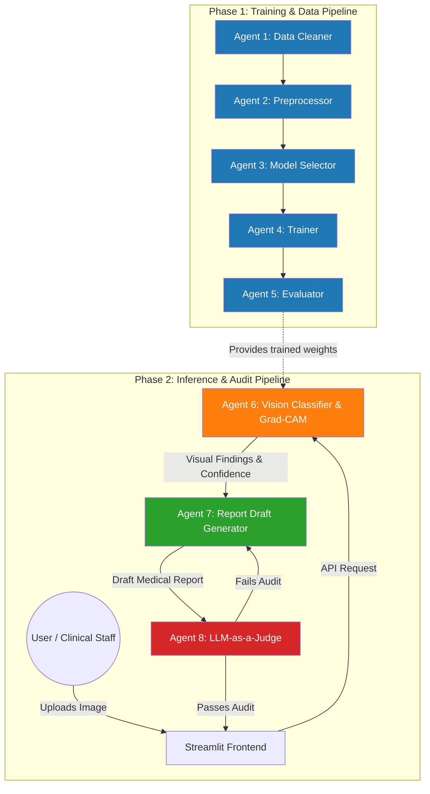
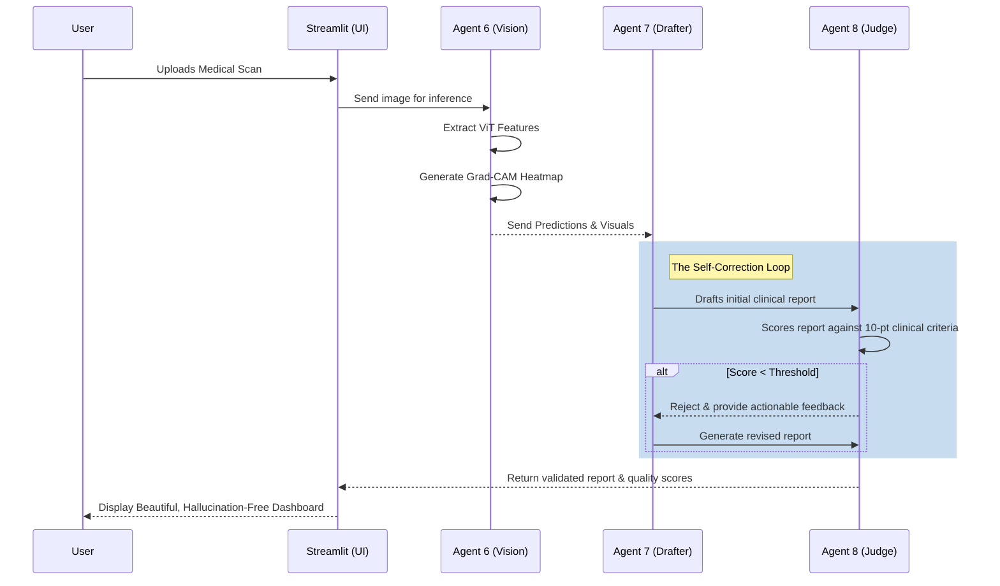

# Multi-Agent Medical Image Classification System with Grad-CAM Explainability and LLM-Driven Automated Reporting


## 💡 The Core Idea
MedVision AI is a cutting-edge **Multi-Agent Artificial Intelligence System** designed to bridge the gap between black-box computer vision models and clinical reliability. 

Traditional AI in healthcare often provides a prediction without explanation, leading to mistrust among medical professionals. MedVision AI solves this by employing an orchestra of specialized AI agents to not only predict diseases using Vision Transformers (ViT) but also visually explain the prediction (Grad-CAM), draft a human-readable clinical report using an LLM, and **automatically audit its own report** for medical accuracy and hallucinations before presenting it to the user.

---

## 🏗️ System Architecture & Multi-Agent Flow

The system is divided into two major phases: **The Training Pipeline** (Agents 1-5) and **The Inference & Audit Pipeline** (Agents 6-8).

### 1. The Multi-Agent Architecture Graph



### 2. Inference Data Flowchart

This sequence diagram illustrates exactly what happens when a user uploads a medical image to the Streamlit UI.



---

## 🔬 Core Components Detailed

### 👁️ Explainable AI (Grad-CAM)
Deep learning models are notoriously opaque. MedVision uses **Gradient-weighted Class Activation Mapping (Grad-CAM)**. When the Vision Transformer predicts a condition, Agent 6 extracts the gradients flowing into the final attention block to produce a heatmap. This highlights exactly which pixels (e.g., a specific tumor region in an MRI) led to the AI's decision.

### ⚖️ The "LLM-as-a-Judge" (Agent 8)
Large Language Models are prone to hallucinations—inventing patient data or diagnosing conditions not present in the image. 
Agent 8 acts as a strict clinical auditor. It takes the draft from Agent 7 and evaluates it on a **point-wise clinical checklist**:
1. Are there contradictions with the Vision Model?
2. Did it hallucinate patient age/gender?
3. Is the tone professional?

If the report scores below the acceptable threshold, Agent 8 forces Agent 7 to rewrite it.

---

## 📁 Directory Structure
```text
Major_project/
├── agents/             # The logic for Agents 1 through 5 (Training Pipeline)
├── backend/            # FastAPI backend orchestrating Agents 6, 7, and 8
├── config/             # Environment and system configurations (LLM thresholds, etc.)
├── datasets/           # Raw and cleaned medical image datasets
├── explainability/     # Grad-CAM heatmap generation algorithms
├── frontend/           # The Streamlit interactive user interface
├── llm/                # Prompts, parsers, and LangChain wrappers for Agents 7 & 8
├── models/             # PyTorch model architectures and saved weights
└── outputs/            # Generated heatmaps, logs, and validated JSON medical reports
```

---

## 🚀 Execution Guide

Follow these commands to run the project. You can either use the **Quick Start** to jump straight to the UI, or run the full training pipeline.

### ⚡ Quick Start (Inference & UI Only)
If you don't want to train the model from scratch, you can download our pre-trained 343MB Vision Transformer weights and jump straight into the application.

1. **Download the pre-trained weights:**
   ```bash
   python download_weights.py
   ```
2. **Start the FastAPI Backend:**
   ```bash
   python -m uvicorn backend.main:app --host 0.0.0.0 --port 8000 --reload
   ```
3. **Start the Streamlit Frontend (in a new terminal):**
   ```bash
   streamlit run frontend/Home.py
   ```
*Open your browser to `http://localhost:8501` to use the system!*

---

### 🏗️ Advanced: Full Training & Data Pipeline
If you want to train the model yourself, run these sequentially to prepare data and train the vision model.
```bash
# 1. Agent 1 (Data Cleaning): Automatically cleans and validates raw dataset
python agents/agent1_data_cleaning.py

# 2. Agent 2 (Data Preprocessing): Resizes and normalizes images for the ViT
python agents/agent2_preprocessing.py

# 3. Agent 3 (Model Selection): Initializes architecture and hyperparameters
python agents/agent3_model_selection.py

# 4. Agent 4 (Model Training): Trains the Vision Transformer
python agents/agent4_training.py

# 5. Agent 5 (Model Evaluation): Tests model against validation data
python agents/agent5_evaluation.py
```

## 🛠️ Technology Stack
- **Backend Orchestration:** FastAPI, Uvicorn, LangChain
- **Computer Vision:** PyTorch, torchvision, OpenCV, Grad-CAM
- **Language Models:** Groq (Llama-3/GPT integration)
- **Frontend / UI:** Streamlit, Custom HTML/CSS
- **Data Management:** Pandas, Pillow, NumPy